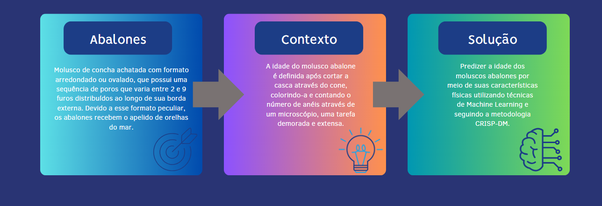

# Abalones - Análise e Predições por meio das Características Físicas

O seguinte projeto tem por objetivo predizer a idade do molusco abalone por meio de técnicas de Machine Learning através da metodologia CRISP-DM. O Abalone é um organismo marinho de suma importância econômica, sendo crucial compreender padrões e características que influenciam seu desenvolvimento. Neste projeto abordaremos desde a importação inicial dos dados até a implementação de modelos preditivos, explorando insights para o entendimento das características físicas desse molusco.

A análise de dados do abalone transcende o escopo meramente econômico, abraçando também uma relevância ambiental substancial. A compreensão dos fatores que afetam seu crescimento e comportamento não apenas oferece informações valiosas para o setor econômico, mas também se mostra crucial para a preservação e sustentabilidade dessa espécie marinha.

A aplicação das técnicas de ciência de dados a um contexto biológico específico, como o estudo do abalone, promete enriquecer significativamente as habilidades e conhecimentos dos participantes envolvidos nesse processo analítico. Isso não só amplia horizontes para um aprendizado mais amplo, mas também destaca a versatilidade e a aplicabilidade das ferramentas de análise de dados em áreas tão diversas quanto a biologia marinha e a conservação ambiental. Essa abordagem interdisciplinar não apenas aprimora a compreensão dos dados do abalone, mas também revela a capacidade da ciência de dados em contribuir para questões de importância global, transcendendo fronteiras disciplinares.


## Resumo Gráfico



## Desenvolvedores

 - [Anne Carvalho](github.com/annecarv)
 - [Augusto César](github.com/augustces)
 - [Catherine Markert](github.com/cathmarkert)
 - [Hernando Henrique](github.com/hernandohas)
 - [João Barboza](https://github.com/joaovcbarboza)

---

### Organização de diretórios


```
.
├── data/              # Diretório contendo todos os arquivos de dados
│   ├── external/      # Arquivos de dados de fontes externas
│   ├── interim/       # Arquivos de dados intermediários
│   ├── processed/     # Arquivos de dados processados
│   └── raw/           # Arquivos de dados originais, imutáveis
├── docs/              # Documentação gerada através da biblioteca mkdocs
├── models/            # Modelos treinados e serializados, predições ou resumos de modelos
├── notebooks/         # Diretório contendo todos os notebooks utilizados nos passos
├── references/        # Dicionários de dados, manuais e todo o material exploratório
├── src/               # Código fonte utilizado nesse projeto
│   ├── data/          # Classes e funções utilizadas para download e processamento de dados
│   ├── deployment/    # Classes e funções utilizadas para implantação do modelo
│   └── model/         # Classes e funções utilizadas para modelagem
├── app.py             # Arquivo com o código da aplicação do streamlit
├── Procfile           # Arquivo de configuração do heroku
├── pyproject.toml     # Arquivo de dependências para reprodução do projeto
├── poetry.lock        # Arquivo com sub-dependências do projeto principal
├── README.md          # Informações gerais do projeto
└── tasks.py           # Arquivo com funções para criação de tarefas utilizadas pelo invoke

```